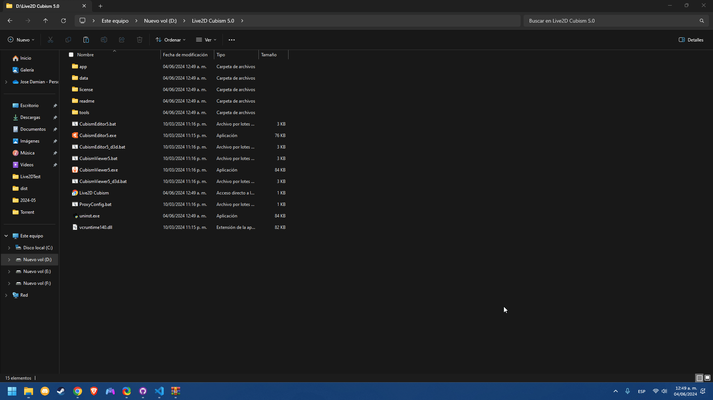

# Live2D-AutoCrack Guide

User guide for the Java and exe versions of the program

**Index**
1. [Exe Version Guide](#id1)
2. [Java Version Guide](#id2)

## Exe version Guide
## Requiremnts
* None
### Steps
* Download the latest version from [Releases](https://github.com/Mecogumi/Live2D-Crack/releases)
* Extract and copy both files `Live2D-AutoCrack.exe` and `rlm1501.jar` to the Live2D root folder (Note: if they are not in the root folder, the exe will not work, since it uses the JRE of Live2d itself)
* Run the `Live2D-AutoCrack.exe`
* Select the directory where live2d is located
* Select Crack
    * If any errors occur during the cracking process, the cause is probably the location of Live2D since the ProgramFiles folder, which is the default when installing, requires administrator permissions to read and write. Possible solutions:
        * Run `Live2D-Autocrack.exe` with administrator privileges
        * Install Live2D to a path that does not require administrator privileges
* Wait until it says "Done"
* Finished

### Example

## Java Version Guide
### Requeriments
 * Java

### Steps
 * Download the latest version from [Releases](https://github.com/Mecogumi/Live2D-Crack/releases)
 * Run the .bat or perform the following command in CMD: `java -jar "Live2D-AutoCrack.jar"`
 * Select the directory where live2d is located
 * Select Crack
    * If any errors occur during the cracking process, the cause is probably the location of Live2D since the ProgramFiles folder, which is the default when installing, requires administrator permissions to read and write. Possible solutions:
        * Run `Live2D-Autocrack.bat` or the CMD with administrator privileges
        * Install Live2D to a path that does not require administrator privileges
 * Wait until it says "Done"
 * Done

### Example

<<<<<<< HEAD
=======
## Exe version
## Requiremnts
 None
### Steps
* Download the latest version from [Releases](https://github.com/Mecogumi/Live2D-Crack/releases)
* Extract and copy both files `Live2D-AutoCrack.exe` and `rlm1501.jar` to the Live2D root folder (Note: if they are not in the root folder, the exe will not work, since it uses the JRE of Live2D itself)
* Run the `Live2D-AutoCrack.exe`
* Select the directory where live2d is located
* Select Crack
    * If any errors occur during the cracking process, the cause is probably the location of Live2D since the ProgramFiles folder, which is the default when installing, requires administrator permissions to read and write. Possible solutions:
        * Run `Live2D-Autocrack.exe` with administrator privileges
        * Install Live2D to a path that does not require administrator privileges
* Wait until it says "Done"
* Finished

you must run `Live2D-AutoCrack.exe` as administrator, this happens since the original path of Live2D is mostly located within the ProgramFiles folder which requires administrator permissions to be able to read and write

### Example

>>>>>>> 8e1dc60b40b1b522777ec3d98a0d139cab626d26
